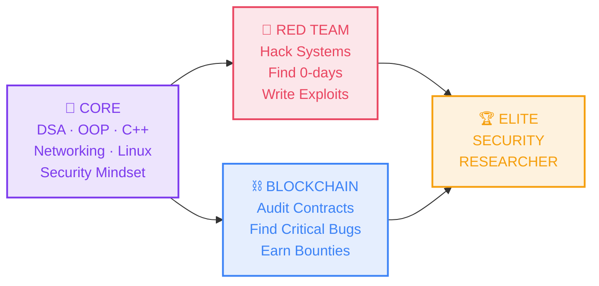
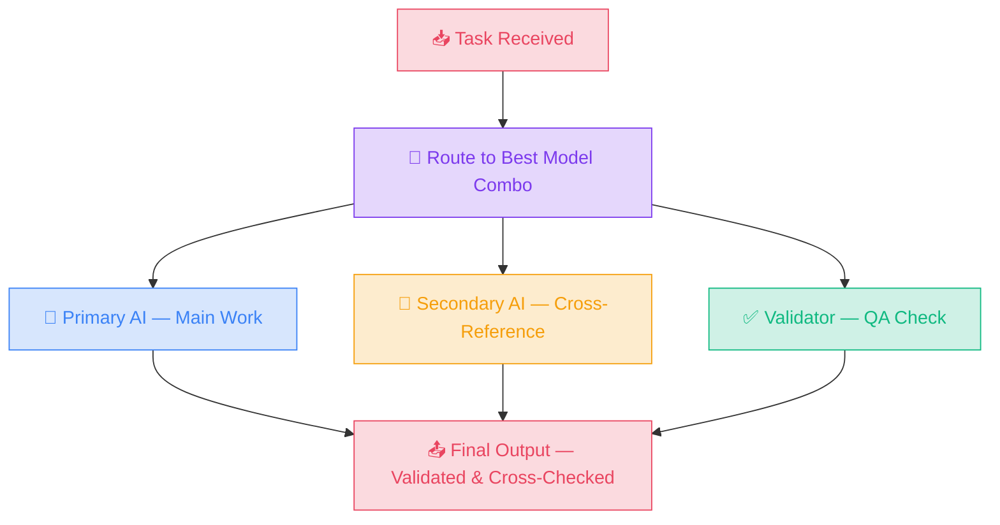
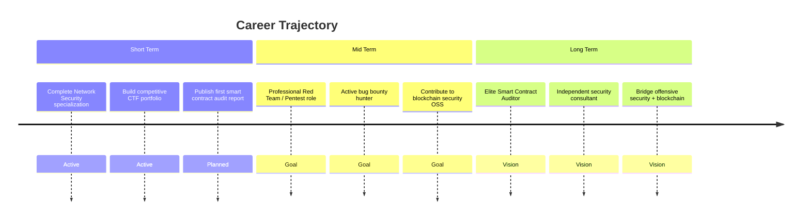

<!-- ═══════════════════════════════════════════════════════════════ -->
<!--                    MOSHI — GITHUB PROFILE                     -->
<!--        © 2025 Nguyen Dinh An Ninh. All rights reserved.       -->
<!--   Original design. Please create your own, don't copy mine.   -->
<!-- ═══════════════════════════════════════════════════════════════ -->

  <picture>
    <source media="(prefers-color-scheme: dark)" srcset="./assets/header-dark.svg">
    <source media="(prefers-color-scheme: light)" srcset="./assets/header-light.svg">
    
  </picture>

 

  &nbsp;
  &nbsp;
  &nbsp;
  &nbsp;
  

  

---

## 🧬 About

**Nguyen Dinh An Ninh** — alias **Moshi**. 3rd-year Information Technology student specializing in **Network Security**. I break systems to understand them, then build them back stronger.

🔴 **Offensive Security** — Pentesting, Exploit Development, Reverse Engineering

⛓️ **Blockchain Security** — Smart Contract Auditing, DeFi Vulnerability Research

🤖 **AI-Augmented** — Running 4 frontier AI models in parallel for maximum output

📍 Ho Chi Minh City, Vietnam

---

## ⚔️ What I Do

<table>
<tr>
<td width="50%" valign="top">

### 🔴 Offensive Security

> *Find it. Exploit it. Report it.*

- **Penetration Testing** — Web, Network, Infrastructure
- **Vulnerability Research** — OWASP Top 10, CVE Analysis
- **Binary Exploitation** — Buffer Overflow, ROP Chains
- **Reverse Engineering** — Ghidra, GDB, Assembly
- **Privilege Escalation** — Linux & Windows
- **Active Directory** — Kerberoasting, Pass-the-Hash
- **CTF Player** — HackTheBox, TryHackMe, OverTheWire

</td>
<td width="50%" valign="top">

### ⛓️ Blockchain Security

> *Audit it. Break it. Patch it.*

- **Smart Contract Auditing** — Solidity, Vyper
- **DeFi Security** — Flash Loans, Oracle Manipulation
- **EVM Internals** — Bytecode, Storage Layout, Gas Optimization
- **Known Vulns** — Re-entrancy, Overflow, Access Control
- **Security Patterns** — Checks-Effects-Interactions, Guards
- **Audit Reports** — Professional vulnerability disclosure
- **Bug Bounty** — Code4rena, Sherlock, Immunefi

</td>
</tr>
</table>

 

---

## 📊 Academic Performance

<table>
<tr>
<td width="50%">

| Technical Core | Score | Grade |
|:---|:---:|:---:|
| Data Structures & Algorithms | **9.8** | ⭐ A |
| Discrete Mathematics | **9.8** | ⭐ A |
| Software Engineering | **9.8** | ⭐ A |
| Probability & Statistics | **9.3** | ⭐ A |
| Windows Programming | **9.3** | ⭐ A |
| Computer Networking | **9.0** | ⭐ A |
| Information Security | **8.5** | ⭐ A |

</td>
<td width="50%">

| Applied & Research | Score | Grade |
|:---|:---:|:---:|
| Applied Psychology | **8.8** | ⭐ A |
| Artificial Intelligence | **8.3** | B+ |
| Programming Techniques | **8.3** | B+ |
| Computer Architecture | **8.3** | B+ |
| OOP (Java) | **7.8** | B+ |
| Database Administration | **7.0** | B |

</td>
</tr>
</table>

   
  &nbsp;
  &nbsp;
  &nbsp;
  

---

## 🤖 AI Arsenal

> I run **4 frontier AI models simultaneously**. Each has a specialized role. Cross-validation ensures maximum output quality.

<table>
<tr>
<td align="center" width="25%">
 
  
<b>🧠 Deep Reasoning</b>  
Complex logic chains Code generation Research synthesis
  
</td>
<td align="center" width="25%">
 
  
<b>📄 200K Context</b>  
Full codebase analysis Architecture review Audit report writing
  
</td>
<td align="center" width="25%">
 
  
<b>⚡ Agentic Coding</b>  
Multimodal analysis Full-stack development Real-time research
  
</td>
<td align="center" width="25%">
 
  
<b>🔓 Unfiltered Intel</b>  
Real-time X data Crypto intelligence Trend analysis
  
</td>
</tr>
</table>

<b>⚙️ How I orchestrate 4 AIs in parallel (click to expand)</b>

 

| Task | Primary | Secondary | Reasoning |
|:---|:---|:---|:---|
| **Smart Contract Audit** | Claude Max | ChatGPT Pro | Claude reads entire codebases (200K); GPT validates logic |
| **Full-Stack Development** | Gemini Ultra | Claude Max | Gemini codes agentically; Claude reviews architecture |
| **Security Research** | ChatGPT Pro | Grok Heavy | GPT for deep analysis; Grok for real-time threat intel |
| **Report / Documentation** | Claude Max | Gemini Ultra | Claude writes precisely; Gemini fact-checks |
| **Crypto / DeFi Analysis** | Grok Heavy | ChatGPT Pro | Grok has live X data; GPT synthesizes findings |

> **Philosophy:** Each AI excels in a specific cognitive zone. Orchestrating them in parallel achieves output quality no single model can match — like a Red Team where each operator has a distinct specialty.

---

## 🛠️ Tech Stack

#### 「 Languages 」

#### 「 Frameworks & Runtime 」

#### 「 Databases 」

#### 「 Security & DevOps 」

#### 「 Tools 」

<b>📋 Proficiency Breakdown (click to expand)</b>

 

| Domain | Technologies | Level |
|:---|:---|:---|
| **AI / Prompt Engineering** | ChatGPT Pro, Claude Max, Gemini Ultra, Grok Heavy | 🟢🟢🟢🟢🟢🟢🟢🟢🟢⚫ **95%** |
| **Backend** | Node.js, Express, ASP.NET Core, PHP | 🟢🟢🟢🟢🟢🟢🟢🟢⚫⚫ **80%** |
| **Frontend** | React, Next.js, HTML/CSS/JS, Tailwind | 🟢🟢🟢🟢🟢🟢🟢🟢⚫⚫ **80%** |
| **Database** | MySQL, MongoDB, SQLite, Turso | 🟢🟢🟢🟢🟢🟢🟢⚫⚫⚫ **70%** |
| **DevOps** | Docker, Vercel, GitHub Actions, Sentry | 🟢🟢🟢🟢🟢🟢🟢⚫⚫⚫ **70%** |
| **Security Tools** | Burp Suite, Nmap, Wireshark, Metasploit, Kali | 🟢🟢🟢🟢🟢🟢⚫⚫⚫⚫ **60%** |
| **Blockchain** | Solidity, Remix, Foundry, EVM | 🟢🟢🟢🟢🟢⚫⚫⚫⚫⚫ **50%** |
| **Reverse Engineering** | Ghidra, GDB, Assembly | 🟢🟢🟢🟢⚫⚫⚫⚫⚫⚫ **40%** |

> *Security & Blockchain proficiency actively increasing*

---

## 🔧 Security Toolkit

<table>
<tr>
<td width="33%" valign="top">

#### 🔍 Reconnaissance

  
  
  
  
  
  

</td>
<td width="33%" valign="top">

#### ⚡ Exploitation

  
  
  
  
  
  

</td>
<td width="33%" valign="top">

#### 🔬 Analysis & Audit

  
  
  
  
  
  

</td>
</tr>
</table>

---

## 📌 Featured Projects

| | Project | Stack | Description |
|:---:|:---|:---|:---|
| 🛒 | **[DOTNET_PROJECT](https://github.com/caykeongot-git/DOTNET_PROJECT)** | `ASP.NET Core` `React` `MySQL` | Full-Stack Web Store with MVC Architecture |
| 📝 | **[Homework-List](https://github.com/caykeongot-git/Homework-List)** | `React` `Node.js` | Student Task Management App |
| 🎬 | **[CinemaChain](https://github.com/caykeongot-git/CinemaChain)** | `Full-Stack` | Cinema Booking Platform |
| 🏦 | **[CoreBanking](https://github.com/caykeongot-git/CoreBanking)** | `Full-Stack` | Banking System Simulation |
| 📤 | **[QUICK-SHARE](https://github.com/caykeongot-git/QUICK-SHARE)** | `HTML/JS` `WebRTC` | Cross-Platform File Transfer PWA |
| 🍅 | **[POMODORO](https://github.com/caykeongot-git/POMODORO_NINH_MOSHI_2026)** | `Web App` | Productivity Timer App |

<b>📂 All Projects (click to expand)</b>

 

| Project | Stack | Description | Status |
|:---|:---|:---|:---:|
| **DOTNET_PROJECT** | ASP.NET Core, React, MySQL | Full-Stack Web Store (MVC) | 🟢 Active |
| **Homework-List** | React, Node.js | Student Task Manager | 🟢 Active |
| **FlashNote** | React, Node.js, Turso | Vocabulary Learning SaaS | 🔵 Building |
| **QuickShare PWA** | HTML/JS, WebRTC | Cross-Platform File Transfer | 🔵 Building |
| **Blockchain Security Lab** | Solidity, HTML5 | Interactive Vulnerability Simulator | 🔵 Building |
| **OMEGA System** | React, Node.js | Contest Management Platform | 🟢 Active |
| **HUTECH Landing Page** | HTML, CSS, JS | Apple-Premium UI Design | ✅ Complete |

---

## 🎯 Direction

---

## 📈 GitHub Analytics

  

---

## 🎧 Off-Duty

<b>What I do when the terminal is closed (click to expand)</b>

 

| | |
|:---:|:---|
| 🏎️ | **Supercar enthusiast** — V12 engines, Lamborghini, Bugatti. The dream that fuels the grind. |
| 🎵 | **Music** — Phonk & Lofi on SoundCloud while hacking at 2AM. |
| 🎮 | **Gaming** — Rise of Kingdoms (strategy), Play Together (chill). |
| 🍿 | **Cinema** — CGV Diamond member. Weekend recharge ritual. |
| 💰 | **Crypto** — DeFi, tokenomics, on-chain analysis. |
| 🏋️ | **Fitness** — 3 semesters of bodybuilding. Body + Brain = Balanced. |

---

  

 

  

  Built by <b>Moshi</b> · Powered by <b>ChatGPT Pro</b> · <b>Claude Max</b> · <b>Gemini Ultra</b> · <b>Grok Heavy</b>

